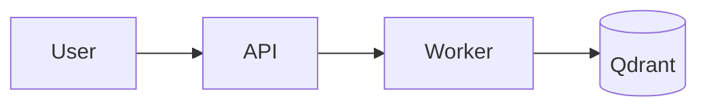

# Как мы пишем документацию: arc42 + MADR + C4 + Mermaid

Это методичка для агентов и людей, которые будут писать целевые документы по проекту «Переписываем ТЗ». Спеки-источники — в соседних папках (`arc42/`, `madr/`, `c4/`, `mermaid/`), индекс ссылок — в [`_links.md`](./_links.md). При написании опирайтесь на скачанные источники, а не на «как обычно делают».

---

## 1. arc42 — какие секции мы используем

Полный шаблон arc42 — 12 секций (см. `arc42/docs-arc42-org-sections.md` и канонические asciidoc-шаблоны в `arc42/EN-adoc/`). Использовать **все 12 для каждого документа не нужно** — это явно разрешено самой arc42: «выбирайте только то, что добавляет ценность».

Для нашего проекта обязательны:

| № | Секция | Зачем нам | Где живёт |
|---|--------|-----------|-----------|
| 1 | Introduction and Goals | Зачем существует система, кому она нужна, top quality goals | главный документ системы |
| 3 | Context and Scope | Что внутри, что снаружи; интерфейсы с 1С, с внешним ИИ, с пользователем | главный документ + C4 Context |
| 4 | Solution Strategy | Ключевые архитектурные решения одним списком (без подробностей — те уходят в ADR) | главный документ |
| 5 | Building Block View | Из чего состоит система; здесь живут C4 Container/Component | главный документ + поддиаграммы |
| 6 | Runtime View | Как компоненты взаимодействуют в ключевых сценариях; здесь живут Mermaid sequence | главный документ или отдельный файл per-flow |
| 8 | Crosscutting Concepts | Сквозные штуки: логирование, безопасность, наблюдаемость, авторизация | главный документ |
| 9 | Architecture Decisions | **Не разворачиваем здесь** — просто индекс/ссылки на `docs/decisions/NNNN-*.md` (ADR в MADR) | главный документ |
| 12 | Glossary | Термины 1С / Azimut / ИИ-пайплайна — чтобы новые люди не вязли | главный документ |

Используем по обстоятельствам:

- **2. Constraints** — если у заказчика есть жёсткие технические/организационные ограничения (например «только on-prem», «только конкретная LLM»).
- **7. Deployment View** — когда дойдём до развёртывания (docker-compose / k8s / on-prem); сейчас может быть пусто.
- **10. Quality** — если будем расписывать quality scenarios под NFR-ы.
- **11. Risks and Technical Debt** — когда накопится debt, или для рисков по миграции с bsl-atlas.

**Правило:** если секция пустая — оставляем заголовок с одной фразой «здесь пока нечего сказать, см. <ссылка>». Не удаляем — это сигнал читателю, что мы про этот аспект подумали и решили его не разворачивать.

---

## 2. C4 — какие уровни нам нужны

См. `c4/c4model-home.md`, `c4/c4model-diagrams.md`, `c4/c4model-notation.md`.

**Минимум (обязательно для каждой подсистемы, которую описываем):**

- **Level 1 — System Context.** Один прямоугольник «наша система» + актёры (пользователь, 1С, внешние сервисы). Отвечает: «кто с системой взаимодействует».
- **Level 2 — Container.** Что у нас крутится как отдельные процессы / стораджи (API, воркер, vector store, реранкер, и т.п.). Отвечает: «из каких бегущих штук состоит система». **Технологии указываем явно** (Python/FastAPI, Qdrant, etc) — это требование нотации C4.

**Точечно (только там, где модуль реально сложный):**

- **Level 3 — Component.** Внутренности отдельного контейнера. Делаем **не для всех контейнеров**, а только для тех, где внутри >2-3 нетривиальных компонентов. Если контейнер — это просто FastAPI с тремя ручками, Component-уровень не рисуем.

**Не делаем сейчас:**

- **Level 4 — Code.** Слишком детально, рот, поддерживать дороже чем читать код напрямую.
- **System Landscape, Dynamic, Deployment** — по необходимости, не по умолчанию.

**Правила нотации (из `c4/c4model-notation.md`, не выдумывать):**

- У каждой диаграммы — **заголовок** (тип + scope: «System Context — Azimut ИИ-ассистент»).
- У каждой диаграммы — **legend / ключ**: что значат формы, цвета, типы линий. Без легенды диаграмма не считается законченной.
- Тип элемента (Person / Software System / Container / Component) указывается явно.
- У каждого элемента — короткое описание ответственности.
- У контейнеров и компонентов — **технология явно** (язык, фреймворк, БД).
- Стрелки — **однонаправленные**, с **конкретным глаголом** («reads from», «publishes events to», «authenticates via JWT»). Запрещены «Uses», «Talks to» и прочие пустые лейблы.
- На связях между контейнерами указываем **протокол** (HTTPS/JSON, gRPC, AMQP, и т.д.).

---

## 3. ADR в формате MADR

Каноническая структура — см. `madr/template/adr-template.md`. Под наш проект адаптируем так:

### Файл и имя

- Папка: `docs/decisions/`.
- Имя файла: `NNNN-kebab-case-title.md`, где `NNNN` — порядковый номер (0001, 0002, …).
- Подпапки внутри `decisions/` допускаются для крупных подсистем (`decisions/ingestion/`, `decisions/retrieval/`) — со своей локальной нумерацией.

### Шаблон (с нашими полями поверх канонического MADR)

```markdown
---
status: proposed | accepted | rejected | deprecated | superseded by NNNN
date: YYYY-MM-DD
decision-makers: [Сергей, …]
consulted: [имена]
informed: [имена]
# Наши доп. поля
linear-task: HLE-XXX            # задача Linear, в рамках которой принято решение
basis: [HLE-YYY, ссылка-на-doc] # на чём основано: предыдущие задачи, документы, эксперимент
implemented-in: [файл/модуль]   # где реализовано — для траcсировки «решение ↔ код»
related-to: [NNNN, NNNN]        # связанные ADR (не «заменяет» и не «заменяется»)
supersedes: NNNN                # какое решение это ADR отменяет (если применимо)
superseded-by: NNNN             # каким ADR это решение отменено (заполняется задним числом)
---

# {Короткий заголовок: что решили}

## Context and Problem Statement

Что происходит, какую проблему решаем. 2-4 предложения или короткая история.
Можно ссылаться на структурные элементы (контейнеры/компоненты из C4).

## Decision Drivers

* что нас давит (NFR, ограничение, force)
* …

## Considered Options

* Вариант 1: …
* Вариант 2: …
* Вариант 3: …

## Decision Outcome

Выбран вариант N — **{название}** — потому что **{коротко: главный аргумент}**.

### Consequences

* Хорошо: …
* Хорошо: …
* Плохо: …

### Confirmation

Как проверим, что решение действительно реализовано (тесты, ArchUnit-подобные правила, ревью, метрика). Если автопроверки нет — пишем «manual: ревью при merge».

## Pros and Cons of the Options

### Вариант 1
* Хорошо: …
* Нейтрально: …
* Плохо: …

### Вариант 2
* …

## More Information

Ссылки на эксперименты, бенчмарки, обсуждения, видео-созвоны, связанные ADR.
```

**Маппинг полей из тикета HLE-493 на наш фронтматтер:**

| Из тикета | В шаблоне |
|-----------|-----------|
| Реализуется в | `implemented-in:` |
| Связан с | `related-to:` |
| Заменяет | `supersedes:` (и парный `superseded-by:` в старом ADR) |
| Задача Linear | `linear-task:` |
| Основание | `basis:` |

**Правила оформления:**

- Одно решение = один ADR. Не делать «ADR на всё про auth».
- Принятое решение **не редактируется задним числом** (кроме `superseded-by`). Если решение устарело — пишется новый ADR со `status: accepted` и `supersedes: NNNN`, а старый получает `status: superseded by NNNN`.
- Не использовать ADR как место для подробной спецификации — для этого есть arc42-документы. ADR — это **обоснование выбора**, а не описание реализации.

---

## 4. Mermaid в markdown

См. `mermaid/mermaid-intro.md`, `…-flowchart.md`, `…-sequence.md`, `…-c4.md`.

### Зачем именно Mermaid

GitHub / GitLab рендерят Mermaid в markdown-файлах нативно, без билда. Никакого `dot`/`plantuml`/`drawio` для базовых диаграмм — иначе diff в PR превращается в бинарь.

### Как встраивать

Fenced code block с языком `mermaid`:

````markdown

````

Несколько мелких правил, чтобы было читаемо в git-рендере:

- **Заголовок и legend** для C4-диаграмм добавляем **до** или **сразу после** кодоблока обычным markdown (заголовок `### …`, маркированный список «синие — наши, серые — внешние, и т.п.») — Mermaid C4 не поддерживает встроенный legend.
- Для **System Context / Container / Component** используем `C4Context` / `C4Container` / `C4Component` (см. `mermaid/mermaid-c4.md`). Для деплоя — `C4Deployment`, но он экспериментальный, аккуратнее.
- Для **runtime-сценариев из секции 6 arc42** — `sequenceDiagram` (см. `mermaid/mermaid-sequence.md`). Каждый сценарий — своя диаграмма, не пытаемся уложить всё в одну.
- Для **бизнес-flow / pipeline** — `flowchart LR` (см. `mermaid/mermaid-flowchart.md`).
- На стрелках — глагол + (для контейнерных диаграмм) технология/протокол: `API -->|HTTP/JSON| Worker`, а не `API --> Worker`.
- Имена узлов — латиница и цифры, человекочитаемые лейблы — в скобках/кавычках. Кириллица в id работает, но иногда ломает парсер — лучше id латиницей, текст внутри `[...]` любой.

### Что мы НЕ делаем

- Не строим Mermaid Code-уровень (level 4 C4) — слишком детально.
- Не используем экзотику (XY chart, Sankey, Wardley) без явной нужды — read-rate в гите низкий, понятность хуже.
- Не вставляем SVG/PNG-картинки как замену Mermaid там, где Mermaid справится. Картинки — для скриншотов UI и реальных фото.

---

## 5. TL;DR порядок работы для следующих задач

1. **arc42**-документ верхнего уровня для системы/подсистемы — берём шаблон секций из `arc42/EN-adoc/`, выбираем нужные (см. таблицу выше), пишем по структуре.
2. **C4-диаграммы** (Context + Container обязательно, Component — если сложно) — пишем через Mermaid `C4Context`/`C4Container`. Каждая диаграмма с заголовком и legend.
3. **Runtime-сценарии** для секции 6 arc42 — Mermaid `sequenceDiagram` на каждый ключевой flow.
4. **ADR** для каждого нетривиального выбора — `docs/decisions/NNNN-title.md` по шаблону из раздела 3 выше. Из arc42-секции 9 — только индекс ссылок на эти ADR, без копипасты содержания.
5. Все ссылки на источники — через `[[ссылка]]` в самих документах + индекс в `_links.md`.
