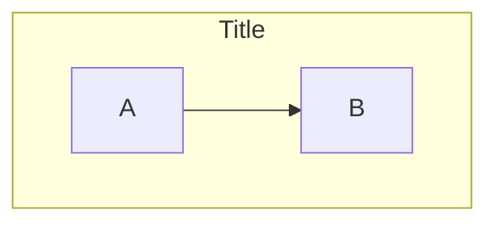

# Mermaid — Flowchart Syntax

> Source: https://mermaid.js.org/syntax/flowchart.html
> Access date: 2026-05-27
> Method: WebFetch (HTML → markdown summary)

## Declaration & Direction

Start flowcharts with `flowchart` or `graph` followed by a direction:

- **TB / TD** — Top to bottom (default)
- **BT** — Bottom to top
- **LR** — Left to right
- **RL** — Right to left


## Node Shapes

| Shape | Syntax | Example |
|-------|--------|---------|
| Default (rectangle) | `A[text]` | `A[Process]` |
| Round edges | `A(text)` | `A(Action)` |
| Stadium | `A([text])` | `A([Start])` |
| Subroutine | `A[[text]]` | `A[[Subprocess]]` |
| Cylindrical | `A[(text)]` | `A[(Database)]` |
| Circle | `A((text))` | `A((Node))` |
| Asymmetric | `A>text]` | `A>Process]` |
| Diamond | `A{text}` | `A{Decision?}` |
| Hexagon | `A{{text}}` | `A{{Prepare}}` |
| Parallelogram | `A[/text/]` | `A[/Input/]` |
| Parallelogram alt | `A[\text\]` | `A[\Output\]` |
| Trapezoid | `A[/text\]` | `A[/Priority\]` |
| Trapezoid alt | `A[\text/]` | `A[\Manual/]` |
| Double circle | `A(((text)))` | `A(((Stop)))` |

### New `@{ shape: ... }` Syntax (v11.3.0+)

```
A@{ shape: rect }
B@{ shape: circle }
C@{ shape: diamond }
```

Supported shape keys include: `bang`, `cloud`, `hourglass`, `cyl` (cylinder), `diam` (diamond), `tri` (triangle), `hex` (hexagon), `stadium`, `doc` (document), `flag`, `lean-r`, `lean-l`, `datastore`, and ~30 others.

## Link / Arrow Types

| Type | Syntax | Description |
|------|--------|-------------|
| Arrow | `A --> B` | Standard directed arrow |
| Open | `A --- B` | No arrowhead |
| Dotted | `A -.-> B` | Dashed line with arrow |
| Dotted open | `A -.- B` | Dashed line, no arrow |
| Thick | `A ==> B` | Bold arrow |
| Thick open | `A === B` | Bold line, no arrow |
| Circle endpoint | `A --o B` | Circle endpoint |
| Cross endpoint | `A --x B` | Cross endpoint |
| Invisible | `A ~~~ B` | Hidden link (positioning) |

## Link Labels

```
A -- text --> B
A -->|text| B
A -- text --- B
```

## Link Length (use extra dashes to span ranks)

```
A -----> B      %% 4 extra dashes
A ===== B       %% thick with extra length
A -.-.-> B      %% dotted with extra length
```

## Subgraphs



Set direction within subgraphs using `direction TD/LR/etc`.

## Styling & Classes

```
classDef className fill:#f9f,stroke:#333,stroke-width:4px;
class nodeId className;
```

Shorthand inline:

```
A --> B:::className
```

Default class applied to all unstyled nodes:

```
classDef default fill:#f9f,stroke:#333;
```

## Comments

```
%% This is a comment
```

## Special Characters & Escaping

Wrap problematic text in quotes:

```
A["Text with 'special' chars"]
```

HTML entity codes: `&#35;` for `#`, or named entities.

## Markdown Strings (inside nodes)

```
A["**Bold** and *italic* text"]
```

## Interaction

```
click nodeId callback
click nodeId call callback()
click nodeId href "https://url" "Tooltip text"
```

## Edge IDs & Animation (v11.9.0+)

```
e1@A --> B
class e1 animate
```

## Configuration (renderer / curve)

```
---
config:
  flowchart:
    defaultRenderer: "elk"
    curve: stepBefore
---
```

Available curves: `basis`, `bumpX`, `bumpY`, `cardinal`, `catmullRom`, `linear`, `monotoneX`, `monotoneY`, `natural`, `step`, `stepAfter`, `stepBefore`.
