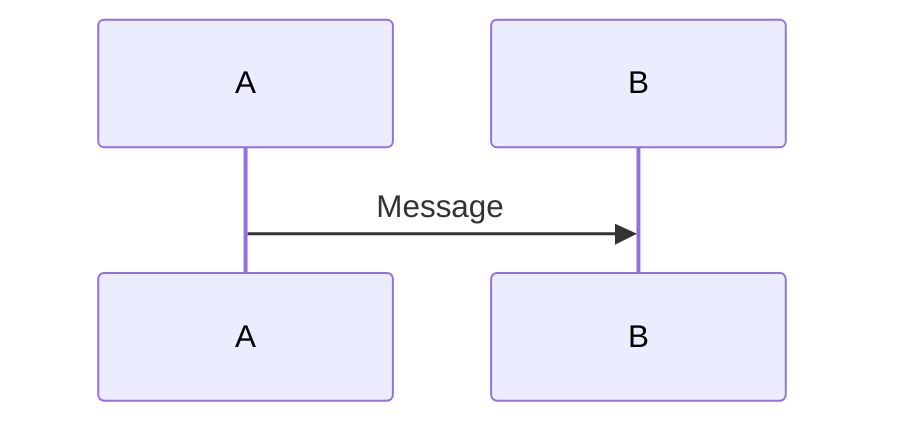

# Mermaid — Sequence Diagram Syntax

> Source: https://mermaid.js.org/syntax/sequenceDiagram.html
> Access date: 2026-05-27
> Method: WebFetch (HTML → markdown summary)

## Basic Declaration



## Participants & Actors

**Implicit declaration:** Participants appear in order of first message.

**Explicit ordering** (controls layout):
```
sequenceDiagram
    participant Z
    participant A
    participant M
```

**Actor symbol:**
```
sequenceDiagram
    actor A
    A->>B: Hello
```

**Aliases:**
```
participant A as Alice
```

## Message Arrow Types

| Type | Description |
|------|-------------|
| `->` | Solid line, no arrow |
| `-->` | Dotted line, no arrow |
| `->>` | Solid with arrowhead |
| `-->>` | Dotted with arrowhead |
| `<<->>` | Bidirectional solid |
| `<<-->>` | Bidirectional dotted |
| `-x` | Solid with cross (lost message) |
| `--x` | Dotted with cross |
| `-)` | Solid async arrow |
| `--)` | Dotted async arrow |

## Activations

Explicit:
```
activate A
deactivate A
```

Shorthand (append `+` / `-` to arrow):
```
A->>+B: Call
B-->>-A: Return
```

## Notes

```
Note right of A: Text
Note left of B: Text
Note over A,B: Spanning two actors
```

Line breaks use `<br/>` tags.

## Control Flow Structures

**Loops:**
```
loop Loop description
    A->>B: Message
end
```

**Alternatives:**
```
alt Condition A
    A->>B: Message
else Condition B
    A->>C: Message
end
```

**Optional:**
```
opt Optional action
    A->>B: Message
end
```

**Parallel:**
```
par Action 1
    A->>B: Message
and Action 2
    C->>D: Message
end
```

**Critical region:**
```
critical Critical action
    A->>B: Message
option Circumstance
    A->>C: Alternative
end
```

**Break:**
```
break Exception occurred
    A->>B: Message
end
```

## Background Highlighting

```
rect rgb(200, 150, 255)
    A->>B: Message
end
```

## Sequence Numbering

```
autonumber
```

Custom start/increment (v11.15.0+):
```
autonumber 10 5
```

## Grouping

```
box Aqua Group Name
    participant A
    participant B
end
```

## Actor Creation/Destruction (v10.3.0+)

```
create participant B
A->>B: Hello

destroy B
A->>B: Goodbye
```

## Comments

Lines prefaced with `%%`.
