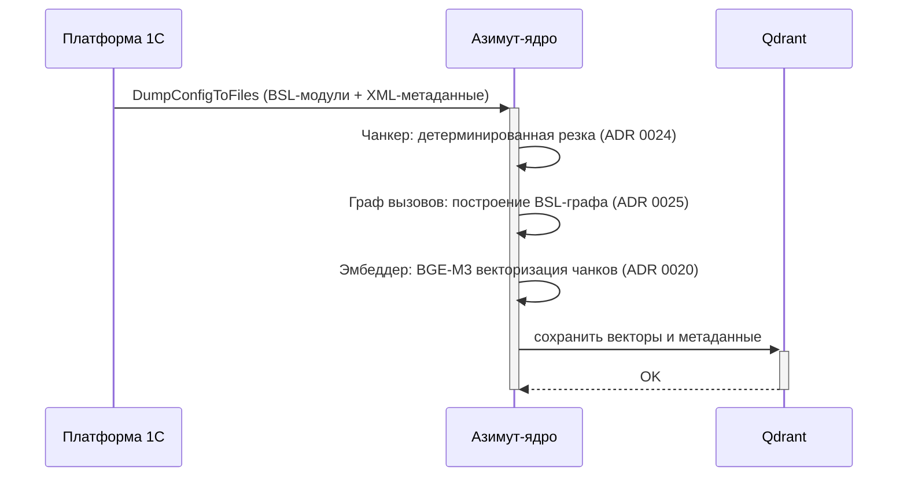
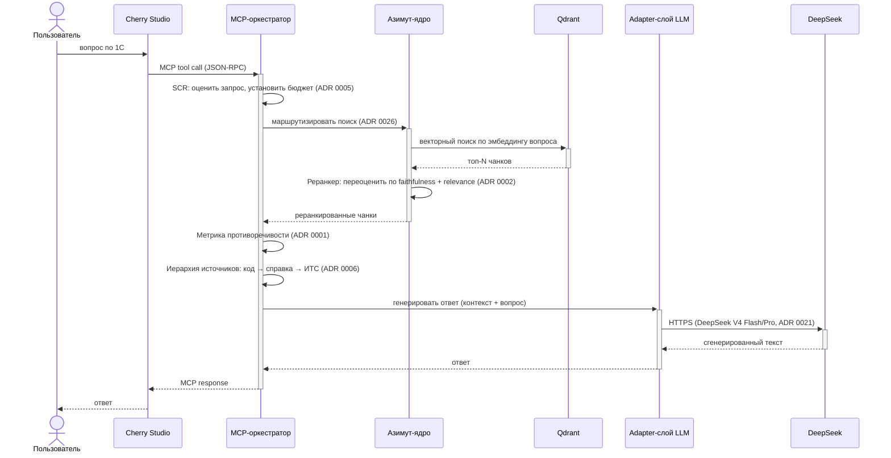
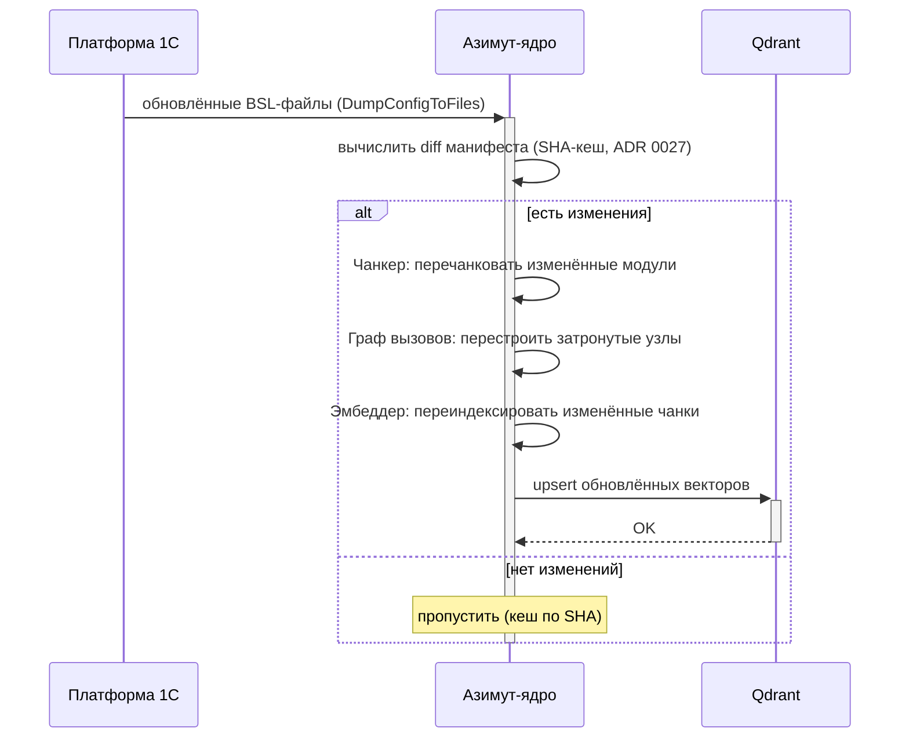
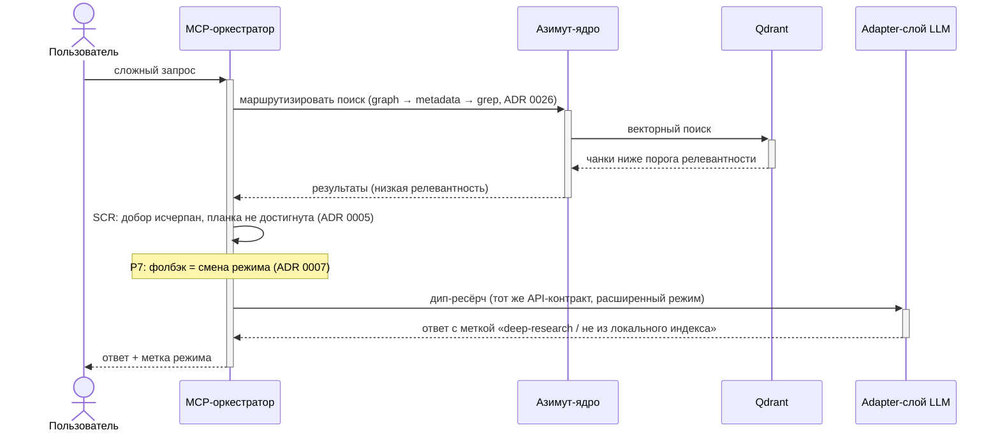
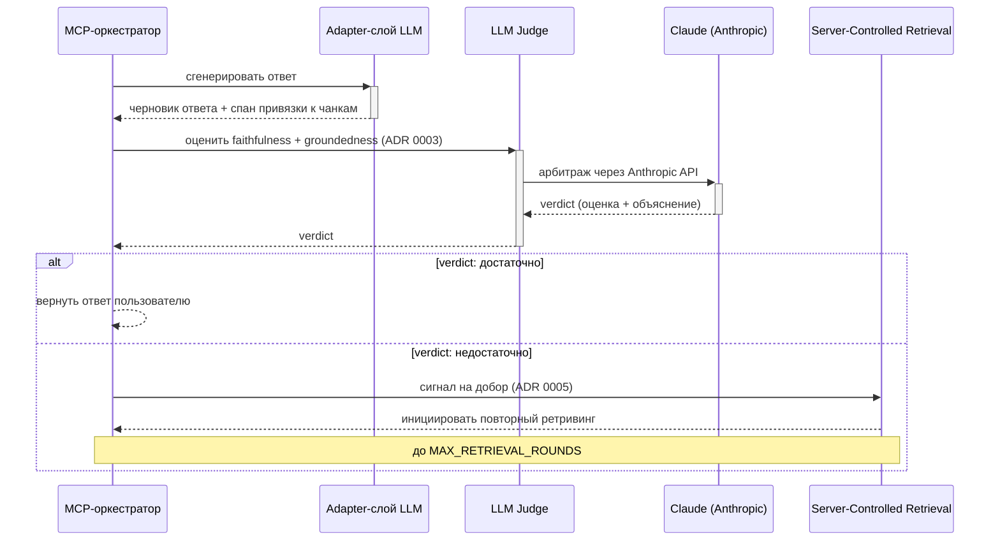

# 6. Поведение в рантайме (Runtime View)

> ⚠️ **Этот файл не предназначен для Structurizr viewer.** Mermaid `sequenceDiagram` блоки ниже Structurizr Local не рендерит — приходят как сырой код на нечитаемом dark-фоне.
>
> Открывай этот файл **в одном из мест с рендером Mermaid:**
> - GitHub web: [`docs/architecture/06-runtime-view.md` на github.com](https://github.com/hleserg/azimut/blob/master/docs/architecture/06-runtime-view.md)
> - IDE с Mermaid-плагином (VS Code + Markdown Preview Mermaid Support, JetBrains встроенно)
> - Любой markdown-viewer с Mermaid (Obsidian, Typora и т.п.)
>
> Structurizr-viewer (`docker compose --profile diagrams up -d structurizr`) — только для C4 views из `workspace.dsl`. Runtime-сценарии живут здесь как Mermaid намеренно (ADR 0034: «Mermaid `sequenceDiagram` — только для §6, лучше читается в git diff»).

---

> arc42 §6 — ключевые сценарии взаимодействия компонентов.
> Диаграммы: Mermaid `sequenceDiagram` (единственное место в документации, где допускается Mermaid, ADR 0034).

---

## 6.1 Сценарий: Индексация кода

Платформа 1С экспортирует BSL-файлы → Азимут-ядро строит индекс → векторы сохраняются в Qdrant.

✅ проверено: `workspace.dsl` (связи onecPlatform → azimuthCore → qdrant + компоненты Азимут-ядра)

---

## 6.2 Сценарий: Запрос пользователя

Пользователь задаёт вопрос → клиент → MCP-оркестратор → ретривинг → генерация → ответ.

✅ проверено: `workspace.dsl` (связи клиент → mcpOrchestrator → azimuthCore/qdrant/llmAdapter)

---

## 6.3 Сценарий: Обновление индекса

Изменились BSL-файлы → инкрементальная переиндексация только изменённых модулей.

✅ проверено: ADR 0027 (техника кеша по SHA из feenlace)

---

## 6.4 Сценарий: Фолбэк Р7 (смена режима)

Ретривинг не набирает достаточной релевантности → оркестратор переключается в дип-ресёрч.

✅ проверено: ADR 0007 (Р7: фолбэк = смена режима), ADR 0005 (планка релевантности SCR)

---

## 6.5 Сценарий: LLM-судья Р3

После генерации чернового ответа LLM-судья проверяет faithfulness и groundedness; при недостаточном score — триггер добора.

✅ проверено: ADR 0003 (Р3: LLM-судья со спан-привязкой), ADR 0005 (SCR: сигнал на добор)

